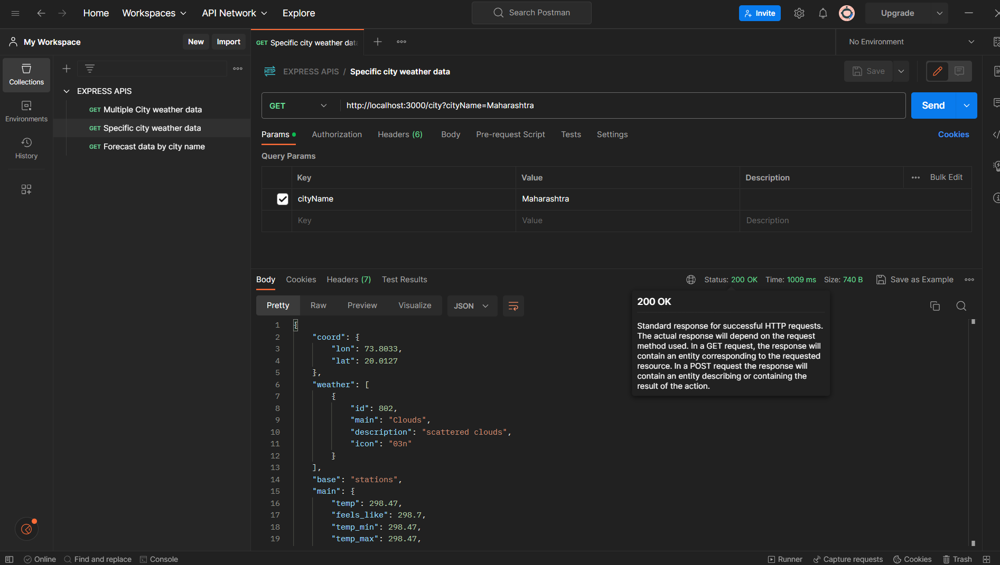
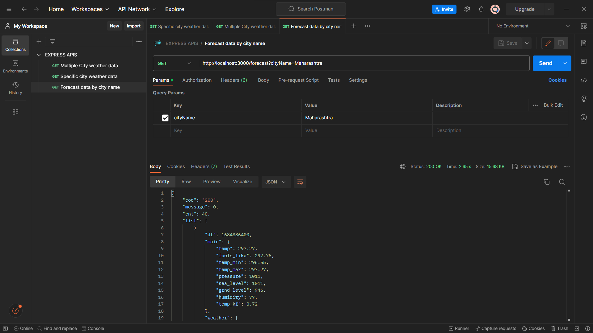
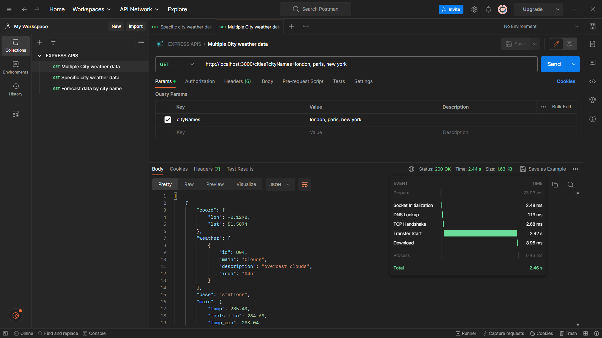

## My first node application - *WeatherWise*
This apps is all about creating small node app and adding express app to be used as middleware.

```
Node version used here - 
18.12.1

NOTE : Please look into package.json for detailes packages and their versions.
```

## How to setup a node app
---

- download node from https://nodejs.org/en/download and install
- run `npm install` to get all packages installed as per package.json
- run `npm start`
- Navigate to http://localhost:3000/ either on browser/ postman wherever you will hit this url you'll basically get simple `hello world` printed.
- To check further API I'm attaching postman snippets for more clarity over request and response.

<br/>
<br/>

### *Check specific city weather*


<br/>

### *Check specific city forecast*


<br/>

### *Check multiple city weather*



